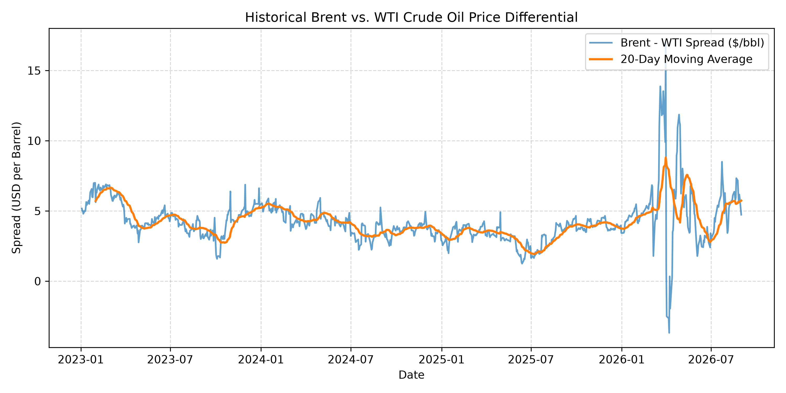

# Brent vs. WTI Crude Oil Spread Analysis

Automated Python data pipeline fetching market benchmarks (`BZ=F`, `CL=F`), calculating daily price differentials, and plotting rolling 20-day moving averages.

